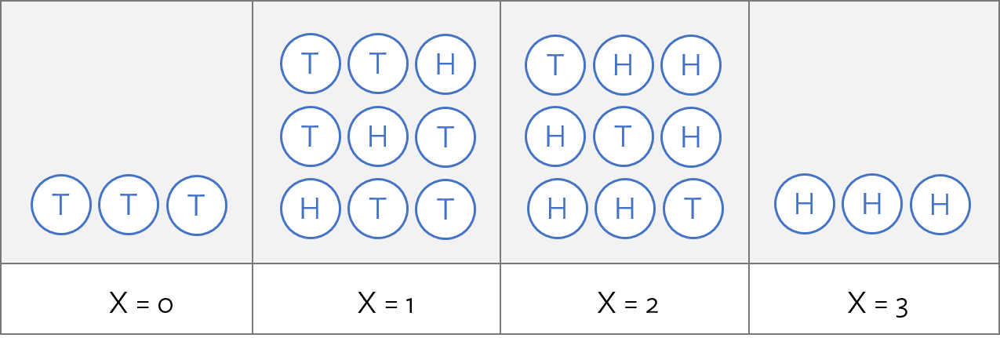

# Today's Goals

* Wrap-up important concepts of probability - i.e., **independence** and **conditional probability**
* Introduce concepts of probability distributions
* Learn details of a few important probability distributions

***

# Meeting preliminaries

We'll be working with the Portal Survey data this week (again). 
We must first load these data into our work environment.
Also, we'll be focusing only on the Rodent taxa, so let's filter the data to include only rodents

```{r}
library(tidyverse)

surveys <- read_csv("../data/portal_data_joined.csv")
surveys <-
  surveys %>%
  filter(taxa == "Rodent")
```

# Probability 

***

#### Challenge - review

* What are the three main properties of probability (as we've discussed in this class)?
* Define what we mean by **mutually exclusive** events
* Describe the **Law of Large Numbers** and discuss how it relates to the *frequency* of an event
* In what context would you use the **General Addition Rule**? Note - the General Addition Rule is $P(A\text{ or } B ) = P(A) + P(B) - P(A\text{ and }B)$

***


## Independence

> *Two processes are **independent** if knowing the outcome of one provides* no useful information *about the outcome of the other.* - Vu and Harrington 2020, p. 101

***

#### Challenge 

* Is flipping two coins different from flipping one, then the other? 
* You flip 99 heads. What is the probability you will flip a head on the 100th toss?
* For a 6-sided die example, why aren't $P(<4)$ and $P(\text{odd})$ **NOT** independent events?
* You catch a *Neotoma* in a trap in one of the Portal plots. What is the probability that you will catch a *Neotoma* in a trap in one of the other Portal plots?


***

### Multiplication Rule for Independent Processes

From *Vu and Harrington 2020, p. 103*

> If A and B represent events from two different and independent processes, then the probability that both A and B occur is given by:

$$
P(A \text{ and } B) = P(A) \times P(B)
$$

> Similarly, if there are $k$ events $A_1$, ..., $A_k$ from $k$ independent processes, then the probability they all occur is:

$$
P(A_1)P(A_2)...P(A_k)
$$

***

#### Challenge - probability of capturing 100 *Dipodomys* in a row vs capturing 100 *Chaetodipus* in a row.

First recall how we calculated the frequencies / probabilities of capturing each of the different genera of rodents. Then use the multiplication rule to calculate the two probabilities above.

```{r}
genus_frequencies <-
  surveys %>%
  group_by(genus) %>%
  count()

genus_frequencies$freq <- round(genus_frequencies$n / sum(genus_frequencies$n), 4)

knitr::kable(genus_frequencies)
```

***

## Conditional Probability

### Conditional Probability: Intuition

Consider height in the US population.

What is the probability that a randomly selected individual in the population is taller than 6 feet, 4 inches?

* Suppose you learn that the individual is a professional basketball player. Does this change the probability that the individual is taller than 6 feet, 4 inches?

### Conditional Probability: Concept

The **conditional probability** of an event $A$, given a second event $B$, is the probability of $A$ happening, knowing that the event $B$ has happened.

* This conditional probability is denoted $P(A|B)$

What is the probability of trapping a *Dipodomys merriami*?

Let $A$ = capture a *Dipodomys merriami*

```{r}
species_frequencies <-
  surveys %>%
  group_by(genus, species) %>%
  count()

species_frequencies <-
  species_frequencies %>%
  mutate(freq = round(n / sum(species_frequencies$n), 4))

```

What is the probability of trapping a *Dipodomys merriami*, conditional (or *given*) that you captures a *Dipodomys*?

Again, let $A$ = capture a *Dipodomys merriami*, and now $B$ = capture a *Dipodomys*.

```{r}
dipo_frequencies <-
  surveys %>%
  filter(genus == "Dipodomys") %>%
  group_by(species) %>%
  count()

dipo_frequencies <-
  dipo_frequencies %>%
  mutate(freq = round(n / sum(dipo_frequencies$n), 4))

dipo_frequencies
```


### Conditional Probability: Formal Definition

As long as $P(B) > 0$,
\[P(A|B) = \dfrac{P(A \cap B)}{P(B)}. \]

From the definition,
\begin{align*}
P(A|B) =& \dfrac{P(\text{capture a Dipodomys merriami AND capture a Dipodomys})}{P(\text{capture a Dipodomys})} \\
=& \dfrac{0.3094}{0.4721} = 0.6554
\end{align*}

### Independence, Again...

A consequence of the definition of conditional probability:

* If $P(A|B) = P(A)$, then $A$ and $B$ are independent; knowing $B$ offers no information about whether $A$ occurred.


### General Multiplication Rule

If $A$ and $B$ represent two outcomes or events, then
\[P(A \cap B) = P(A|B)P(B).\]

This follows from rearranging the definition of conditional probability:
\[P(A|B) = \frac{P(A \cap B)}{P(B)} \rightarrow P(A|B)P(B) = P(A \cap B)\]

Unlike the previously mentioned multiplication rule, this is valid for events that might not be independent.

### Bayes' Theorem, aka Bayes' Rule

Bayes' Thorem (simplest form):

$$ P(A|B) = \frac{P(B|A)P(A)}{P(B)}$$


Follows directly from the definition of conditional probability by noting that $P(A) P(B|A)$ equals $P(A \text{ and } B)$:

\[P(A|B) =  \frac{P(A \cap B)}{P(B)} = \frac{P(B|A)P(A)}{P(B)}\]

Foundation of Bayesian statistics:

\[P(\text{assumptions}|\text{data}) =  \frac{P(\text{data}|\text{assumptions})P(\text{assumptions})}{P(\text{data})}\]

# Probability Distributions

## Random Variables

A *random variable* is a function that maps each event in a sample space to a number.
  
  - A *discrete random variable* takes on a finite number of values.
  
Suppose $X$ is the number of heads in 3 tosses of a fair coin.

  - $X$ can take on the values 0, 1, 2, 3.



### Distribution of a Discrete Random Variable

The distribution of a discrete random variable is the collection of its values and the probabilities associated with those values.

The probability distribution for $X$ is as follows:

| | | | | |
|--|--|--|--|--|
|$x_i$ | 0 | 1 | 2 | 3 |
|$P(X = x_i)$ | 1/8 | 3/8 | 3/8 | 1/8 |


\[\sum_{x=0}^3 P(X = x_i) = 1 \]

***

## Histograms and density plots as probability distributions

We can look at a density plot of the frequency of the different genera, which would be a probability distribution for genera type.

```{r}
ggplot(data = surveys, aes(x = genus, y = ..prop.., group = 1)) + 
  geom_bar() +
  theme_bw() +
  theme(axis.text.x = element_text(angle = 90)) 

```

**Key idea: We can think of the area for a particular bin as the probability of getting a value that falls into that bin.**


### Emperical distributions versus defined probability distributions

There are *many* defined probability distributions that have specific properties.
In the online lecture you learned about the binomial, Poisson, and normal distributions.
Some properties of distributions to keep in mind:

* The area under the curve, or cumulative area of the bins is equal to 1
* Different values of the variable described by a distribution are on the x-axis
* The corresponding probability value for that particular variable value is on the y-axis (or expressed by the total area of the bin in a histogram plot). *Note - this is not the case for continuous distributions, which we'll discuss later.*
* We often want to focus on the probability distribution(s) that are related to our specific questions. Many of the most common distributions, though not all, can be interpreted as providing the answer to particular questions. Below I have outlined a number of distributions and the questions we might use them to answer.

## Binomial Distribution 

The Binomial distribution can be thought of as the 
sum of $n$ Bernoulli distributions (see below), all with the same 
parameterization (i.e., probability of success = $p$).  
This is useful if we want to find the probability of getting a certain number
of successes if your repeat some experiment many times.

$$
{pdf} = P(x | N,h) = \binom{N}{x} h^x (1-h)^{N-x}
$$

*Question:* What is the number of successes, $x$, in $N$ trials,
where the probability of a success is $h$

### Bernoulli Distribution:

The Bernoulli distribution is a very simple distribution that
can be used if we have a single event (or experiment)
that has two possible outcomes, governed by some probability. 
For example, the probability of the outcome of a 
single coin toss with a fair coin 
can be described using a Bernoulli distribution.

${pdf} = P(x) = p$ if $x=1$ and $(1-p)$ if $x=0$, where
$x$ is the event outcome (i.e., heads or tails)

### Binomial example with Portal data

Let's consider the probability of trapping a *Dipodomys* versus **not** a *Dipodomys*.

P(trap a *Dipodomys*) = 0.4721


Now, let's look at R's internal Binomial distribution function.

```{r}
rbinom(n = 1, size = 100, prob = 0.4721)

new_data <- rbinom(n = 100, size = 100, prob = 0.4721)

ggplot() +
  geom_histogram(data = NULL, 
                 aes(x = new_data, y = ..density.. ), 
                 binwidth = 1) +
  theme_bw()
```

Let's look at this empirically from our data.

How many *Dipodomys* trappings do we get if we randomly selected 100 of the trapping events?

```{r}
# select 100 random rows
rand_rows <- sample(1:nrow(surveys), size = 100)

# grab these rows as a subset of the surveys data set
surveys_subset <- surveys[rand_rows, ]

# count the number of dipodomys
sum(surveys_subset$genus == "Dipodomys")

```

This is equivalent to a **single draw** from a Binomial distribution.

Next, let's try *multiple* draws from our data set.

```{r}
# Create an empty vector of dipo_counts
dipo_counts <- c()

for(x in 1:100){
  # select 100 random rows
  rand_rows <- sample(1:nrow(surveys), size = 100)
  
  # grab these rows as a subset of the surveys data set
  surveys_subset <- surveys[rand_rows, ]
  
  # count the number of dipodomys and add this count to 
  # our dipo_counts vector
  dipo_counts <- c(dipo_counts, sum(surveys_subset$genus == "Dipodomys"))
  
}

```

Now, let's make a histogram of the `dipo_counts` data.

```{r}
ggplot() +
  geom_histogram(data = NULL, 
                 aes(x = dipo_counts, y = ..density.. ), 
                 binwidth = 1) +
  theme_bw()
```

***

#### Challenge - changing *n* and / or *sample size*

Using the code above, experiment with what happens when you change values for *n* and / or *sample size*. In this case, *n* was equal to the number of iterations of our `for` loop and *sample size* was equal to the number of random rows `sample`d from the overall data set.

***

## Normal Distribution

The normal distribution is perhaps the most widely used distribution in life science. 
It is also probably the most familiar.

The probability density function for the normal is:

$$
f(x|\mu,\sigma) \sim \frac{1}{\sqrt{2\pi\sigma^2}} e^{-\frac{(x-\mu)^2}{2\sigma^2}}
$$

Let's dive into working with the Normal in R.

In R, there are several things you can do with all kinds of distributions (not just the normal).
Start by looking for help on `rnorm`

```{r, eval=FALSE}
?rnorm
```

Note that there is `dnorm`, `pnorm`, `qnorm`, and `rnorm`. 
For now, know that `rnorm` generates random variables from the distribution.

```{r}
normal_rvs <- rnorm(n = 100, mean = 0, sd = 1)

ggplot() + 
  geom_histogram( data = NULL, aes(x = normal_rvs) ) +
  theme_bw()
```

#### Challenge

1. Increase the number of random variables drawn.
2. Change the `mean` and `sd` parameters.

### Standard Normal distribution

The **Standard Normal** distribution is a **Normal** distribution with $\mu = 0$ and $\sigma = 1$.

### Normal example with Portal data

Let's look at the distribution of the weight of captured *Chaetodipus*.

```{r}
chaetodipus <-
  surveys %>%
  filter(genus == "Chaetodipus")

ggplot(data = chaetodipus, aes(x = weight, y = ..density..)) +
  geom_histogram() +
  geom_density()
```

### Data transformation

The observed distribution does not appear to be normally distributed. 
But we can change the scale of the values so they appear *more* normal-like.
The most common transformation for this is a **log** transformation, either a $log_e$ or $log_{10}$ transformation.

```{r}
chaetodipus$log_weight <- log10(chaetodipus$weight)

ggplot(data = chaetodipus, aes(x = log_weight, y = ..density..)) +
  geom_histogram() +
  geom_density()
```

OK. Much closer. But there does appear to be some bimodality in the distribution.
Why? Perhaps this is due to sex differences. 

```{r}
ggplot(data = chaetodipus, aes(x = log_weight, y = ..density.., fill = sex)) +
  geom_histogram(position = "dodge") +
  geom_density(alpha = 0.3)
```

There appears to be some differences between sexes, particularly larger females.
But there does appear to be two modes even for each sex.

Let's push on and compare our observations to an assumed normal distribution of weights.
To parameterize our distribution, we need to calculate the mean `log_weight` and standard deviation of `log_weight`.

```{r}
mean_chaeto_logweight <- mean(chaetodipus$log_weight, na.rm = TRUE)
sd_chaeto_logweight <- sd(chaetodipus$log_weight, na.rm = TRUE)

ggplot(data = chaetodipus) +
  geom_histogram(aes(x = log_weight, y = ..density..)) +
  geom_density(aes(x = log_weight)) +
  stat_function(fun = dnorm, 
                args = list(mean = mean_chaeto_logweight, sd = sd_chaeto_logweight),
                colour = "blue", alpha = 0.6, size = 2) 

```

OK, now let's calculate some frequencies and probabilities, using both the observed data and *assuming* a normal distribution.

* What's the probability of trapping a *Chaetodipus* greater than the average log(weight), 1.35?

**Based on observations -** count the number of *Chaetodipus* trapped that are greater than 1.35 and divide that number by the total number of *Chaetodipus* trapped.


```{r}
sum(chaetodipus$log_weight > mean_chaeto_logweight, na.rm = TRUE) / nrow(chaetodipus)
```


**Based on assumption of normal distribution -** use R's internal functions.

```{r}
pnorm(q = mean_chaeto_logweight, 
      mean = mean_chaeto_logweight,
      sd = sd_chaeto_logweight, 
      lower.tail = FALSE)
```

***

#### Challenge - calculate, both ways, the probability of catching a *Chaetodipus* whose log(weight) is *less than* 1.


***

## Poisson Distribution:

There are many questions we may ask that are related
to the Poisson distribution. Usually we think of the 
Poisson when we have some process that usually results
in a small number most of the times and produces larger 
numbers less frequently. Think about the number of eggs produced
by some bird, or the number of off spring for some animal. 
By substituting the usual $\lambda$ value in the Poisson 
with $\lambda T$, where $T$ is some defined time period, and 
$\lambda$ is some rate value, **we can use the Poisson to address 
questions concerning the number of successes in some time 
period T**.

$$
{pdf} = P(x|T,\lambda) = \frac{ e^{-(\lambda T)} (\lambda T)^x }{ x! }
$$